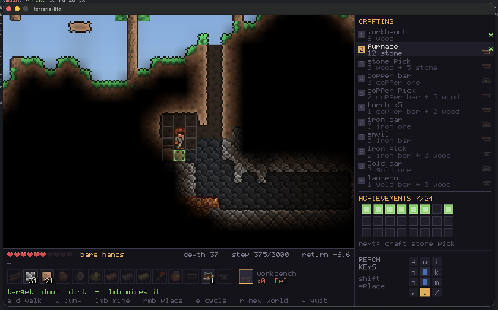

# terraria-lite

A small deterministic Terraria, in C. Built as an RL benchmark in the style of
[Craftax](https://craftaxenv.github.io/), with a terminal frontend and a pixel
frontend for humans.



## Build

```sh
make              # terraria-lite (terminal) + selftest
make terraria-px  # pixel frontend, needs SDL2 (brew install sdl2)
make check        # invariants + scripted expert over 20 seeds
```

## Play — pixel frontend

```sh
./terraria-px --seed 9
```

Mouse drives everything. **Left click mines, right click places** — aim is
forgiving, whichever of the ten cells around you is *nearest* the cursor gets
picked, so you never have to land on it exactly. Click a recipe in the side
panel to craft it, or an inventory slot to select it. `a`/`d` walk, `w` or space
jumps, `e` cycles the placeable, `r` new world.

**A Terraria install is required.** The pixel frontend loads its tile art, item
icons and player sprite from it at runtime — nothing is copied into this repo
and nothing is shipped. The default Steam location is found automatically;
`--textures DIR` points at an `ExtractedTextures` folder elsewhere. The terminal
frontend needs none of this.

`--scale N` sets the pixel zoom (default 2; 3 needs a large display).

## Play — terminal

```sh
./terraria-lite --seed 9
```

The world ticks on a clock, so falls and jumps play out on their own. Standing
still costs nothing.

```
--seed N       world seed (default 1)
--steps N      episode step limit (default 3000)
--tick-ms N    frame length in ms (default 80)
--lockstep     one tick per keypress instead of on a clock
```

## Terminal controls

```
a d   walk            w  jump         s  wait
e     cycle placeable r  new world    q  quit
```

You are **two tiles tall**. Ten cells surround your body, and every one can be
mined or built into — **lower case mines, shift places**:

```
        dx=-1   dx=0   dx=+1
  dy=-2   y/Y    u/U    i/I     above the head
  dy=-1   h/H   [head]  k/K
  dy= 0   n/N   [feet]  m/M
  dy=+1   ,/<    ./>    //?     below the feet
```

Three that matter:

- `.` mine straight down — a controlled descent, no fall damage.
- `<` or `?` place into a down-diagonal — bridges a chasm without losing altitude.
- `>` place under your own feet — pillars upward.

Crafting is `1`-`9`, `0`, `-`. The station must be within 3 tiles.

```
1 workbench   anywhere     7 iron bar    furnace
2 furnace     workbench    8 anvil       workbench
3 stone pick  workbench    9 iron pick   anvil
4 copper bar  furnace      0 gold bar    furnace
5 copper pick workbench    - lantern     anvil
6 torch x5    workbench
```

## The game

Tools gate ores, darkness gates depth. Chop wood, build a bench, work down
through stone → copper → iron → gold, and light your way as you go. 24
achievements; the reward is one point each.

```
wood ──▶ workbench ──▶ furnace ──▶ stone pick ──▶ copper ──▶ copper pick
                                                     └──▶ torch
copper pick ──▶ iron ──▶ iron bar ──▶ anvil ──▶ iron pick ──▶ gold ──▶ lantern
```

## RL

```sh
uv sync --extra rl                       # venv + numpy, gymnasium, torch
make lib                                 # libterraria into the package
uv run python -m terraria_lite.random_agent
```

```python
import terraria_lite                     # also registers TerrariaLite-v0
from terraria_lite import TerrariaLite, SPEC

env = TerrariaLite()
obs, info = env.reset(seed=9)            # obs: flat float32, shape (1836,)
obs, reward, terminated, truncated, info = env.step(action)   # action: 0..35
```

Or through Gymnasium — **import `terraria_lite` first**, that's what registers it:

```python
import terraria_lite
import gymnasium as gym
env = gym.make("TerrariaLite-v0")        # Box(1836) obs, Discrete(36) action
```

The binding itself needs only numpy; `gymnasium` and `torch` come from the
`rl` extra. `uv sync` on its own gives you the environment without them.

The observation is an 11×9 window centred on your feet, plus a 54-value status
vector. **Unlit cells read as "unknown", not as their tile** — darkness is real
for the agent, which is what makes torches worth crafting. In daylight ~79 of
99 cells are visible; 40 tiles down with no torch, 20 are.

Both agents are **action-masked**: about 70% of the 36 actions are inert in any
given state (crafting without materials, mining air), so `env.action_mask()`
returns the ones that would change something. `noop` is always legal, so the
mask is never empty.

```sh
uv run python -m terraria_lite.ppo_agent --steps 600000   # ~40s -> ppo_terraria.pt
uv run python -m terraria_lite.deep_Q_agent 300           # -> dqn_terraria.pt
```

Masked-random scores **4.2 / 24** and never crafts a workbench; that's the
number to beat. PPO reaches ~5.5 and stalls at `craft furnace`.

Compare an agent against the **matched** random control, not a stale one:
masking lifts the floor by itself, so an agent's raw gain overstates what it
learned. Against its own control, DQN went from *losing* to random (−0.02
achievements) to beating it (+0.77), while PPO's margin barely moved
(+1.37 → +1.29) — most of PPO's headline gain was the floor rising underneath
it.

### Watch a policy play

```sh
uv run python -m terraria_lite.watch --policy ppo_terraria.pt --best-of 8 --play
```

This plays episodes, writes the best one to a *tape* — the seed plus the action
taken on every tick — and replays it in the pixel frontend:

```sh
./terraria-px --watch rollout.tape --tick-ms 40
#   space  pause      . step one tick      r restart      q quit
```

torch and SDL never share a process. The engine is deterministic, so replaying
a tape reproduces the episode exactly rather than approximating it — which is
what lets `libterraria` stay free of an SDL dependency the trainer would
otherwise pay for, and lets the replay reuse the frontend's interpolation and
camera easing unchanged. A tape is a small text file, so a good run is worth
keeping. The checkpoint kind (PPO or DQN) is sniffed from its keys.

## Layout

```
include/   frozen contract: tiles.h (taxonomy), env.h (state, actions, obs)
src/       worldgen.c light.c sim.c obs.c   the core: no globals, no malloc
           capi.c                           flat C ABI for the binding
           keymap.h frontend.h              shared by both frontends
           render.c main.c                  terminal frontend
           px_render.c px_main.c            SDL pixel frontend, --watch replay
python/    terraria_lite/__init__.py        ctypes binding + Gymnasium env
           terraria_lite/random_agent.py    baseline / binding smoke test
           terraria_lite/deep_Q_agent.py    DQN: n-step, masked, replay buffer
           terraria_lite/ppo_agent.py       PPO: vectorised, masked
           terraria_lite/watch.py           record a rollout tape and play it
tools/     selftest.c                       invariants + scripted expert
```
